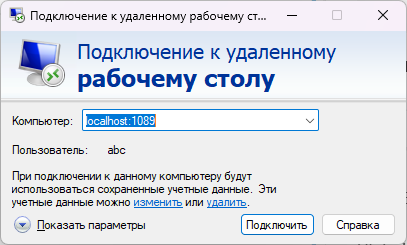

### Использование образа
---
Контейнеры настраиваются с помощью параметров, передаваемых во время выполнения (например, указанных выше). Эти параметры разделяются двоеточием и обозначаются <external>:<internal> соответственно. Например, -p 8080:80 позволяет открыть порт 80 внутри контейнера, чтобы к нему можно было получить доступ с IP-адреса хоста через порт 8080 вне контейнера.

- [Настройка образа](#настройка-образа)
- [Запуск  контейнера](#запуск--контейнера)
  - [Запуск в фоновом режиме для работы с использованием рабочего стола](#запуск-в-фоновом-режиме-для-работы-с-использованием-рабочего-стола)
- [Переменные среды, сборки и тестирования](#переменные-среды-сборки-и-тестирования)


## Настройка образа

**Имя пользователя и пароль по умолчанию: abc/abc**

Для доступа к контейнеру понадобится клиент удалённого рабочего стола (RDP) см. [Список в Википедии⁠](https://en.wikipedia.org/wiki/Comparison_of_remote_desktop_software). По умолчанию контейнер прослушивает порт 3389, но вы можете изменить этот порт на любой другой на стороне хоста, например 3390:3389. 

Первое, что вам нужно сделать после входа в контейнер, — это изменить пароль пользователя abc с помощью команды passwd.
Если вы когда-нибудь забудете свой пароль, вы всегда сможете сбросить его, войдя в контейнер от имени пользователя root:

```bash 

docker exec -it rdesktop passwd abc

```

По умолчанию все действия выполняются от имени пользователя abc и рекомендуется использовать этого пользователя только в контейнере, но можно добавлять и новых пользователей, если в их домашнем каталоге есть исполняемый скрипт startwm.sh . Все эти контейнеры настроены на использование sudo без пароля.

## Запуск  контейнера

### Запуск в фоновом режиме для работы с использованием рабочего стола

```bash 

docker run -d --name=rdesktop -p 1089:3389 --restart unless-stopped docker_dev_1c

```



> **Примечание:** 
У современных настольных приложений с графическим интерфейсом (включая некоторые терминалы) возникают проблемы с последней версией Docker и  совместимостью системных вызовов. Вы можете использовать Docker с настройкой --security-opt seccomp=unconfined для разрешения этих системных вызовов или попробовать podman⁠, так как они обновили свою кодовую базу для их поддержки.

## Переменные среды, сборки и тестирования

На работу контейнера можно повлиять, если переопределить переменные среды при его запуске:

**Переменые среды**

| Имя переменной     | Описание                                                               |
|--------------------|------------------------------------------------------------------------|
|**ENV JAVA_HOME**   |Домашний каталог JAVA <br> *По-умолчанию: <вычисляемый>*                |
|**CLI_LIB_PATH**    |Путь к библиотеке общих скриптов <br> *По-умолчанию: /usr/local/bin/lib*|

**Переменные GITLAB для работы с проектом**

| Имя переменной     | Описание                                                                         |
|--------------------|----------------------------------------------------------------------------------|
|**CI_PROJECT_NAME** |Имя проекта <br> *По-умолчанию:  test_project*                                    |
|**CI_PROJECT_DIR**  |Путь к каталогу к проекту (git-репозиторию) <br> *По-умолчанию: /config/1c_edt*   |

**Переменные сборки проектов и тестирования**

| Имя переменной        | Описание                                                                            |
|-----------------------|-------------------------------------------------------------------------------------|
|**PROJECT_BULD_DIR**   |Путь к каталогу сборки проекта <br> *По-умолчанию: ${CI_PROJECT_DIR}/buld*        |
|**PROJECT_LOG_DIR**    |Путь к каталогу логирования проекта edt <br> *По-умолчанию: ${PROJECT_BULD_DIR}/log* |
|**RING_HOME**          |Домашний каталог RING *По-умолчанию: <вычисляемый>*                                  |
|**EDT_HOME**           |Домашний каталог EDT *По-умолчанию: <вычисляемый>*                                   |
|**EDT_PATH_PROJECT**   |Путь к каталогу проекта <br> *По-умолчанию: edt ${CI_PROJECT_DIR}/src*               |
|**EDT_PATH_WORKSPACE** |Путь к каталогу .workspace edt <br> *По-умолчанию: ${PROJECT_BULD_DIR}/workspace*    |
|**EDT_MEMORY_LIMIT**   |Лимит памяти выделяемый для запуска EDT <br> *По-умолчанию:  6124m*                  |
|**EDT_VMARGS**         |Один или несколько аргументов JVM (например, -Xmx, -D и т. д.). Если заданы, тогда являются приоритетными перед файлоv ini. Например, при импорте проекта можно увеличить размер кучи до 8 Гб (-Xmx8g)    |
|**EDT_MAXTIMEOUT**     |Максимальное время в секундах для выполнения операций edt                            |
|**EDTCLI_SCRIPT_PATH** |Путь к каталогу скриптов для edt 1cedtcli <br> *По-умолчанию: /1c_edt/cli-scripts/*  |
|**_1C_HOME**           |Домашний каталог 1С *По-умолчанию: <вычисляемый>*                                    |
|**_1C_VERSION**        |Версия установленной платформы 1С *По-умолчанию: <вычисляемый>*                      |
|**_1C_DB_NAME**        |Имя тестовой базы 1C <br> *По-умолчанию: "db_test"*                                  |
|**_1C_DB_PATH**        |Путь к тестовой базе 1С <br> *По-умолчанию: ${PROJECT_BULD_DIR}/infobase*            |
|**_1C_DB_PATH_CF**     |Путь к .cf-файлу, на основе которого будет создана база или выгружен из БД <br> *По-умолчанию: ${PROJECT_BULD_DIR}/${CI_PROJECT_NAME}.cf* |

>**Примечание:** Переменные среды из файлов (секреты Docker)
Вы можете задать любую переменную среды из файла, используя специальный префикс FILE__.
В качестве примера:
-e FILE__MYVAR=/run/secrets/mysecretvariable
Переменная среды MYVAR будет установлена на основе содержимого файла /run/secrets/mysecretvariable .

[<- Содержание](../README.md)