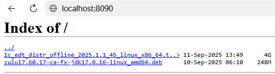

### СБОРКА ОБРАЗА DOCKER
---
- [Этапы сборки](#этапы-сборки)
  - [Подготовка файлов установки](#подготовка-файлов-установки)
  - [Сборка](#сборка)
- [Использование web-сервера в качестве файловового сервера](#использование-web-сервера-в-качестве-файловового-сервера)

## Этапы сборки

### Подготовка файлов установки
Для сборки образа потребуются пакеты установки:

* [1C:Enterprise Development Tools](https://releases.1c.ru/project/DevelopmentTools10)
* [Технологическая платформа 1С:Предприятия для Linux ](https://releases.1c.ru/project/Platform83)
* [1С:Предприятие.Элемент Скрипт](https://releases.1c.ru/project/Script)

После скачивания файлов их необходимо разместить на одном из ресурсов доступных docker при сборке:
* локальный каталог расположения файл DockerDockerfile
* на реурсах web-сервера, который используется как файловый сервер

### Сборка

При сборке образа можно использовать параметризованные аргументы для указания путей расположения инсталяционных файлов:
* PATH_INSTALL_EDT
* PATH_INSTALL_1C
* PATH_INSTALL_EXECUTOR

В примере в качестве путей к файлам используется адрес web-сервера, как источник файлов.

Команда сборки выглядит так:

```bash

docker build -t docker_dev_1c_ex:1.0 .

```

или с переопределением инсталяционных файлов с использованием параметра *--build-arg*: 

```bash

docker build \
    -t docker_dev_1c:1.0 \
    --build-arg PATH_INSTALL_EDT="http://localhost:8090/1c_edt_distr_offline_2025.1.4_15_linux_x86_64.tar.gz" \
    --build-arg PATH_INSTALL_1C="http://localhost:8090/server64_8_3_24_1819.zip" \
    --build-arg PATH_INSTALL_EXECUTOR="http://localhost:8090/script_x_linux_9.0.0-2.zip" \
    -t docker_dev_1c_ex:1.0 .

```

> **Примечание:**
> Команда сборки запускается в каталоге с файлам Dockerfile.
> Если параметры --build-arg PATH_INSTALL_EDT будут пропущены, пути файлов будут взяты по-умолчанию из Dockerfile-файла.
> **Точка в конце команды обязательна!**

## Использование web-сервера в качестве файловового сервера

**Установка локального nginx для сборки**

Если нет доступного web-сервера, его можно запустить на локальной машине.

1. Создайте в папку, где будут храниться файлы дистрибьютивов для сборки образов (Например: <текущая папка>/install).
2. Скопируйте в папку файлы для установки в образ
3. Создайте в текущей папке конфигурационный файл nginx.conf с настройками:

```nginx

server {
   listen       80;
   listen  [::]:80;
   server_name  localhost;

   autoindex on;               # enable directory listing output
   autoindex_exact_size off;   # output file sizes rounded to kilobytes, megabytes, and gigabytes
   autoindex_localtime on;     # output local times in the directory

   location / {
       root /mnt;
    }
}

```

3. Запустите nginx c настройками конфигурационного файла из пункта 2

```bash

#!/bin/bash

docker run \
    --name my-nginx \
    -v $(pwd)/conf/nginx.conf:/etc/nginx/nginx.conf:ro \
    -v $(pwd)/conf/install:/mnt:ro \
    -p 8090:80 \
    -d nginx

```

 В результате по порту указанному при запуске (8090) у нас становиться доступным локальный web-сервер как файловый сервер через протокол http.



[<- Содержание](../README.md)